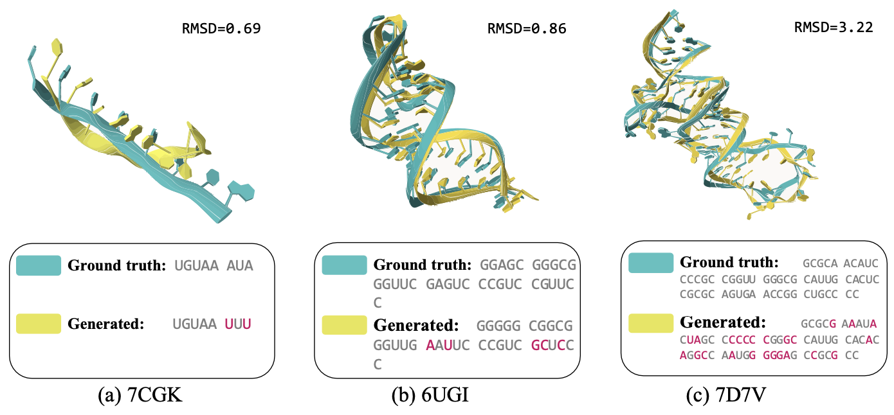

# RDesign: Hierarchical Data-efficient Representation Learning for Tertiary Structure-based RNA Design

  

## Introduction

While artificial intelligence has made remarkable strides in revealing the relationship between biological macromolecules' primary sequence and tertiary structure, designing RNA sequences based on specified tertiary structures remains challenging. Though existing approaches in protein design have thoroughly explored structure-to-sequence dependencies in proteins, RNA design still confronts difficulties due to structural complexity and data scarcity.

In this study, we aim to systematically construct a data-driven RNA design pipeline. We crafted a large, well-curated benchmark dataset and designed a comprehensive structural modeling approach to represent the complex RNA tertiary structure. More importantly, we proposed a hierarchical data-efficient representation learning framework that learns structural representations through contrastive learning at both cluster-level and sample-level to fully leverage the limited data. Extensive experiments demonstrate the effectiveness of our proposed method, providing a reliable baseline for future RNA design tasks.

<p align="center">
  
</p>


## Dataset

We carefully collected representative RNA tertiary structure data from two sources, RNAsolo and the Protein Data Bank (PDB). The refined data has been released [here](https://github.com/A4Bio/RDesign/releases/tag/data). Please download the datasets and organize them as follows.

```
RDesign
├── API
├── assets
├── checkpoints
├── methods
├── model
└── data
    ├── RNAsolo
    │   ├── train_data.pt
    │   ├── val_data.pt
    │   ├── test_data.pt
```


## Citation

If you are interested in our repository and our paper, please cite the following paper:

```
@misc{tan2023hierarchical,
    title={Hierarchical Data-efficient Representation Learning for Tertiary Structure-based RNA Design}, 
    author={Cheng Tan and Yijie Zhang and Zhangyang Gao and Hanqun Cao and Stan Z. Li},
    year={2023},
    eprint={2301.10774},
    archivePrefix={arXiv},
    primaryClass={q-bio.BM}
}
```

## Feedback
If you have any issue about this work, please feel free to contact me by email: 
* Cheng Tan: tancheng@westlake.edu.cn
